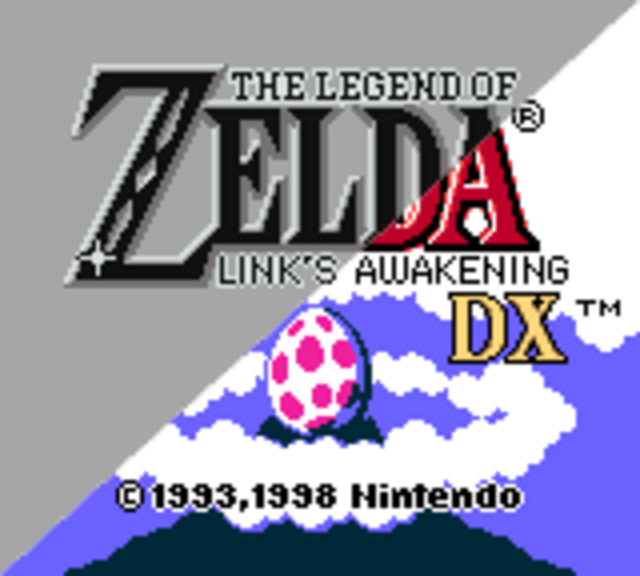

Pandas are really sweet.

Here's a video of a panda eating sweets.

<iframe width="560" height="315" src="https://www.youtube.com/embed/4n0xNbfJLR8" frameborder="0" allowfullscreen></iframe>

TEST
====================================================

Lorem ipsum dolor sit amet
----------------------------------------------------

    Lorem ipsum dolor sit amet...

   