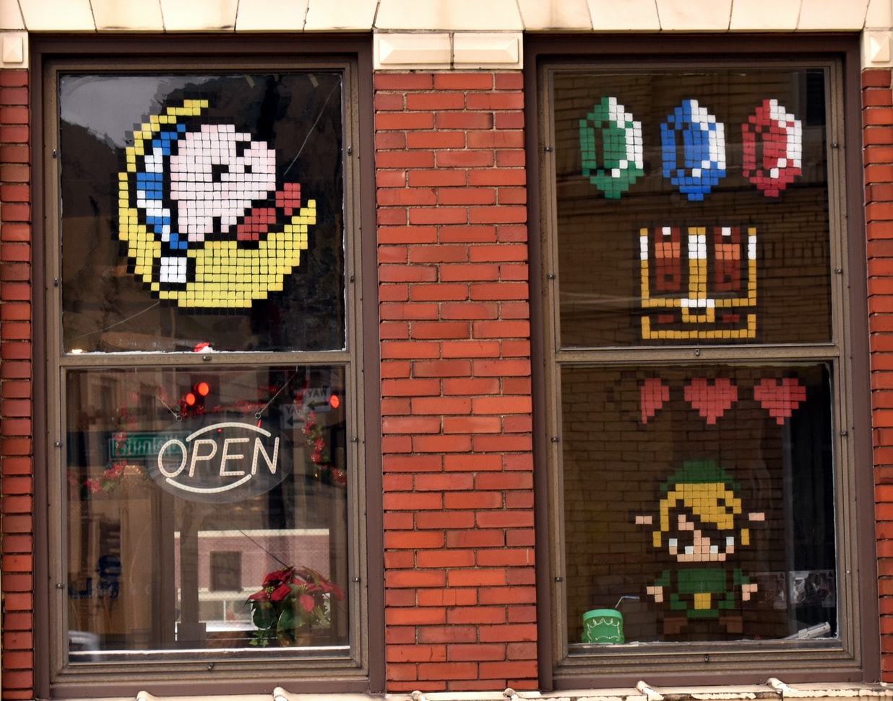
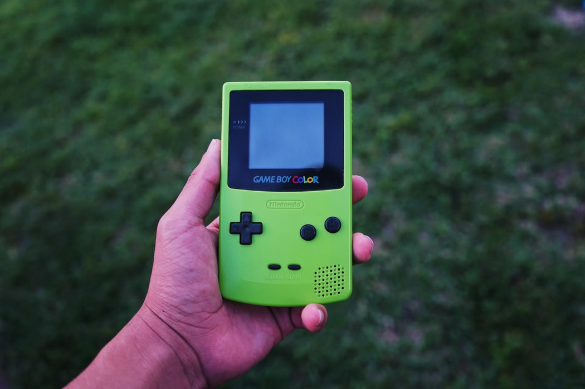

## The Legend of Zelda: Link's Awakening

### Historia powstania

Podstawowa wersja gry miała swoją premierę w czerwcu 1993 roku w Japonii na klasycznego Game Boy’a, reszta świata mogła 
poznawać przygody Linka rok później. Była to czwarta odsłona serii ale pierwsza na konsolę przenośną. Gra rozeszła się w
5 milionach egzemplarzy, co spowodowało wzrost sprzedaży samej konsoli. Po tak wielkim sukcesie nikogo nie zaskoczył fakt,
że gra doczekała się dwóch reedycji.

Pierwsza z nich światło dzienne ujrzała w grudniu 1998 roku i miała pokazać zalety nowej kolorowej konsoli - Game Boy Color. 
Poprawiono znane bugi, dodano kilka nowych przedmiotów, nieznacznie zmodyfikowano niektóre lokacje, jednak przede wszystkim 
wprowadzono nową szatę graficzną, która wzbogaciła grę o kolory. Dodatkowo, żeby jeszcze wzmocnić przekaz i podkreślić moc 
nowej konsoli dodano nowy loch, który zawierał szereg wyzwań i zagadek koncentrujących się właśnie wokół kolorów, a należy 
pamiętać, że barwny wyświetlacz dla przenośnej konsoli robił wówczas niemałą furorę. Oprócz nowej lokacji dodano także sidequest, 
który polegał na zbieraniu pamiątkowych zdjęć z różnych etapów gry i sekretnych lokacji aby móc później wydrukować je na 
gadżecie Game Boy Printer. Ot, kolejny powód, żeby wyposażyć się w to małe cudo i napchać sakiewkę Nintendo. Na koniec 
chciałbym jeszcze wspomnieć, że reedycja posiadała kompatybilność wsteczną, a jedynym zastrzeżeniem było to, że niektóre 
funkcje, jak opisywane wcześniej kolory loch, nie były dostępne na starszej konsoli.

Druga reedycja została wydana w 2019 roku na konsolę Nintendo Switch. Najbardziej w oczy rzuca się odświeżona szata 
graficzna i, o zgrozo, brak kompatybilności wstecznej.

### Od fanowskiego projektu do pełnoprawnej gry

Wszystko zaczęło się od pracownika Nintendo, zapalonego wędkarza i dociekliwego programisty, który po godzinach testował 
możliwości przenośnej konsoli. Do amatorskiego projektu dołączył projektant Takashi Tezuka, odpowiedzialny za grafikę i 
scenariusze poprzednich części serii, a po pewnym czasie przedstawił dyrekcji propozycję przeniesienia przygód Linka na 
konsolę przenośną. Po otrzymaniu zgody zarządu, objął kierownictwo nad nowym projektem.

Początkowo zamiarem twórców było stworzenie portu do wydanej na Super Nintendo The Legend of Zelda: A Link to the Past, 
ale projekt tak pochłonął autorów, że przerodził się w coś zupełnie innego. Tezuka uznał, że skoro projekt powstał z 
pasji to powinni stworzyć taką grę jaką chcą stworzyć bez odtwórczego kopiowania mechaniki poprzedniej części. Wprowadzono 
zatem wiele postaci z innych gier Nintento (zdjęcie księżniczki Peach w liście miłosnym, figurka Yoshiego czy przeciwnicy 
spotykani w innych grach firmy to tylko nieliczne przykłady), a w centrum wykreowanego świata umieszczono wielkie jajo unoszące 
się w chmurach, które z jakiegoś powodu wydawało się twórcom bardzo zabawne.

Stało się zatem jasne, że będzie to nowa część, o której sam projektant wypowiadał się raczej mało pochlebnie stwierdzając, 
że jest to raczej parodia serii niż jej kontynuacja. Na ratunek przybył Yoshiaki Koizumi, który pracował przy fabule 
A Link to the Past i zaproponował, żeby tak stworzony świat był tylko marzeniem sennym, które zniknie po przebudzeniu. 
Dzięki temu zabiegowi wprowadzenie nowych postaci nie wpłynęło na dzieje samego świata a jednocześnie pozwoliło zachować 
wszystkie szalone pomysły twórców.

Tworzenie gry zbiegło się z popularnością serialu Twin Peaks, którego inspiracje widać w fabule Link’s Awakening - 
bohater pojawia się bowiem w małym miasteczku, poznaje jego mieszkańców i rozwiązuje ich problemy. Dlatego jest to 
pierwsza gra z serii skupiająca się mocno na historii świata przedstawionego z rozbudowanymi dialogami, a nie jedynie 
na głównej linii fabularnej.